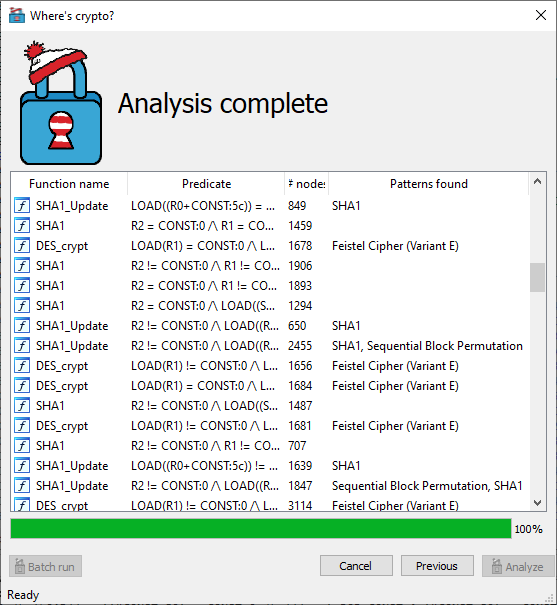

## Where's Crypto?
This is a proof-of-concept implementation related to the paper titled "Where's Crypto?: Automated Identification and Classification of Proprietary Cryptographic Primitives in Binary Code". In short: it is able to automatically identify cryptographic primitives in binaries, even as-of-yet unknown ones, as long as they fall within a taxonomical class of primitives. It comes in the form of a plug-in for the IDA disassembler.

## Building
In order to build this project, you need
- MS Visual Studio (tested version 2017, [2019](https://visualstudio.microsoft.com/thank-you-downloading-visual-studio/?sku=Community&rel=16)). Community edition will do fine.
- CMake (tested version [3.17.3](https://github.com/Kitware/CMake/releases/download/v3.17.3/cmake-3.17.3-win64-x64.msi))
- IDA SDK (tested version 7.2)
- Qt (tested version [5.6.3](https://download.qt.io/new_archive/qt/5.6/5.6.3/qt-opensource-windows-x86-msvc2015_64-5.6.3.exe))

Open a command prompt and navigate to the source directory: `cd c:/path/to/source/directory`
Then, create an empty directory, and navigate to it: `mkdir build; cd build`
Point CMake to the IDA SDK directory and Qt directory, and let it generate MSVC project files: `cmake -DIdaSdk_ROOT_DIR=c:/path/to/idasdk -DQT5_MSVC_DIR=c:/path/to/Qt/Qt5.6.3/5.6.3/msvc2015_64 ..`
You can now open wherescrypto.vcxproj in Visual Studio, or build it directly from the command line: `MSBuild wherescrypto.vcxproj /p:configuration=release`
The library is now ready in the `Release` directory.

## Installation
Build the library using the steps depicted above, or take the prebuilt version from the `prebuilt` directory. Copy it to the IDA plugins directory `c:/path/to/ida/plugins`. Also copy the `signatures` directory to the IDA plugins directory.

## Samples
For your convenience, the binary samples taken from OpenWRT version 19.07.2 are provided in the `samples` directory.
